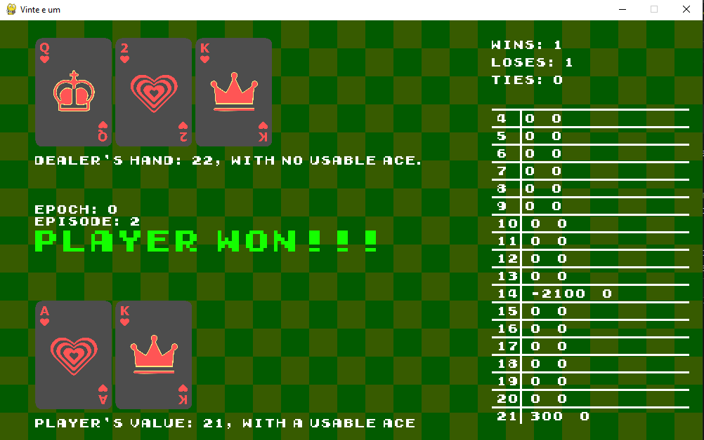

# IA-RL_blackajack
> Matheus Alves

Esse programa foi implementado a usar a _lib_ pygame para o visual, e numpy para a parte numérica.

Foi baseado no artigo [Aplicação de Aprendizado por Reforço no Blackjack: Estudo de Caso de Estimação de Parâmetros](https://www.sba.org.br/open_journal_systems/index.php/sba/article/view/1a732), aplicando o problema do BlackJack com alguma partuicularidades:

- Utilização de apenas 18 estados (baseado nas possibilidades de somas)
- O agente não tem ciência de uma das cartas do dealer
- O agente não considera os ases especiais na tomada de decisão

A política do dealer consiste em pegar cartas até ter enquanto não tiver mais que uma mão valendo no mínimo 17. Caso extrapole 21, o dealer perde.

As recompensas são:
- 1000 caso o agente empate ou vença do dealer
- 1000 caso seja pega uma carta e a mão valha 21 ou menos.
- -1000 * |21 - *sum*| caso o agente pegue uma carta e a mão passe a valer mais que 21, onde *sum* é o valor da mão
- -1000 * |21 - *sum*| caso o agente opte por parar, mas mesmo assim perca para o dealer, onde *sum* é o valor da mão

### Aplicativo:

São mostradas os valores das cartas do dealer e do player.
No meio são mostradas as informações da partida atual, como qual época, episódio, e estado da partida, que varia entre:
- Turno do jogador
- Turno do dealer
- Player venceu
- Player perdeu
- Empate

Na direita tem a tabela **Q**, utilizada no Q Learning, mostrando nas linhas o estado (soma dos valores das cartas), e nas colunas os pesos para as ações, sendo a primeira coluna *parar* (não pegar mais cartas), e a segunda, continuar pegando cartas.

## Resutados:

O artigo trata principalmente da estimação de parâmetros, foram escolhidos resultados expressíveis para a comparação, sendo esses:

| α  | γ  | Média por época - Artigo | Média por época - Trabalho | 
|---|---|---|---|
|  0,30 | 0,15  | 52,7  | (44.2) [arquivo completo](./results_a0.3_0.15.md)|
|  0,7273 | 0,1539  | 51,2  | (43.8) [arquivo completo](./results_a0.7273_0.1539.md)|
| 0,60  |  0,75 |  50,6 | (45.9) [arquivo completo](./results_a0.6_0.75.md)|

Foram rodadas 10 épocas de 100 episódios cada.